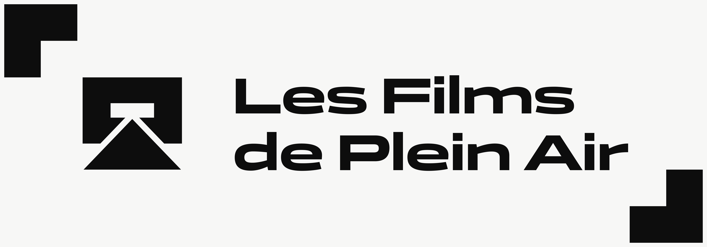

# Les Films de Plein Air : Director's Cut
## Description
Fictional open air film festival, and this is the repository to host the code.

A more extensive description will be broadcasted when the project will near its completion.

## Licensing
There is no open license on this project, because I do not intend to distribute it in any other way than my own usage on my own domain name in my own name. This project has the only purpose of training myself and improving my skills on a Full-Stack JavaScript codebase and pretending the creation of a project as a Freelance Developer and Designer. Although the code is visible in Github, I won't allow :
- forking this code ;
- republish this code ;
- use that code for your own sake ;
- any use of the media I created for this project without my oversight.

However, I am open to a prior discussion in case of an interest for this repository. But for the moment, I don't allow any usage from anyone else but me.

I am sorry it's like this, but I'd rather use that way for now.